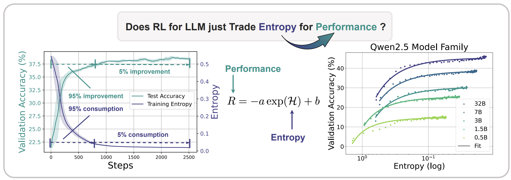
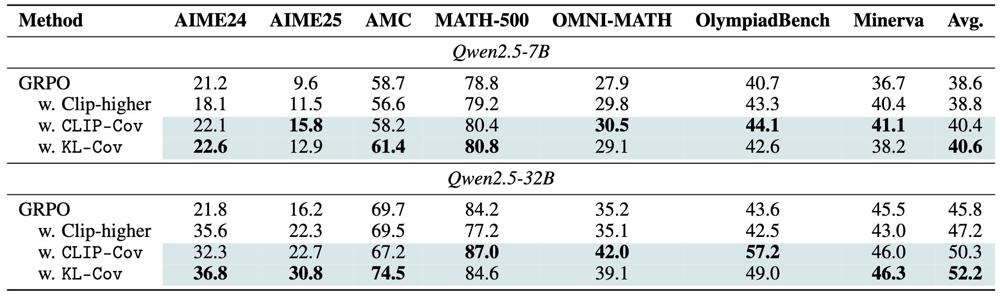
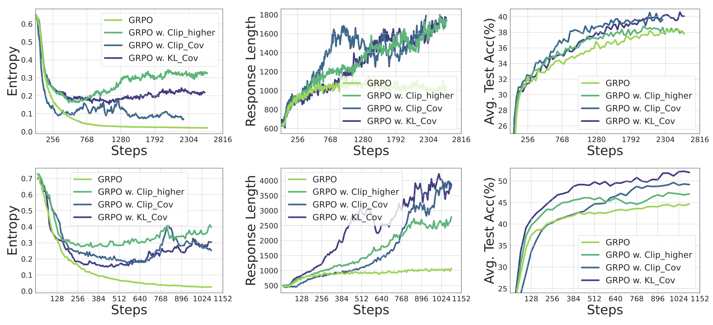

<div align="center">

# The Entropy Mechanism of Reinforcement Learning for Large Language Model Reasoning.

[](https://arxiv.org/pdf/2505.22617)  [](https://github.com/PRIME-RL/Entropy-Mechanism-of-RL) [](https://www.alphaxiv.org/abs/2505.22617) [](https://x.com/stingning/status/1928088554166505667) [](https://x.com/charlesfornlp/status/1928089451080585283) [](https://x.com/_akhaliq/status/1928077929105268861)


<div align="center" style="font-family: Arial, sans-serif;">
  <p>
    <a href="#🎉news" style="text-decoration: none; font-weight: bold;">🎉 News</a> •
    <a href="#✨getting-started" style="text-decoration: none; font-weight: bold;">✨ Getting Started</a> •
    <a href="#📖introduction" style="text-decoration: none; font-weight: bold;">📖 Introduction</a>
  </p>
  <p>
    <a href="#🎈citation" style="text-decoration: none; font-weight: bold;">🎈 Citation</a> •
    <a href="#🌻acknowledgement" style="text-decoration: none; font-weight: bold;">🌻 Acknowledgement</a> •
    <a href="#📈star-history" style="text-decoration: none; font-weight: bold;">📈 Star History</a>
  </p>
</div>

</div>


# 🎉News

- **[2025/05/29]** 🎉 Ranked **#1** of the day on [Huggingface Daily Papers](https://huggingface.co/papers?date=2025-05-29).
- **[2025/05/29]** Released our Paper on arXiv. See [here](https://arxiv.org/pdf/2505.22617). We provide insights into the entropy mechanism of RL for LLMs and propose two simple yet effective strategies to alleviate the entropy collapse. 

# ✨Getting started

This repo is forked from the latest [verl](https://github.com/volcengine/verl). We build our code on the [dapo recipe](https://github.com/PRIME-RL/Entropy-Mechanism-of-RL/tree/main/recipe/dapo)

## Installation
You can install dependencies by running the following commands:
```
conda env create -n entropy -f environment.yaml
``` 

## Training

For training Qwen2.5-7B on a single node, taking the KL-Cov approach as an example, you can simply run:

```
cd Entropy-Mechanism-of-RL
conda activate entropy
bash recipe/dapo/7b_kl_cov.sh
```

While for training Qwen2.5-32B on multi nodes, you can try to run:

```
cd Entropy-Mechanism-of-RL
conda activate entropy
bash recipe/dapo/32b_kl_cov.sh
```

If you encounter some issues of starting Ray on the multi nodes, you can try the alternative way:

```
export WANDB_API_KEY=YOUR_WANDB_KEY
source /your/path/to/miniconda3/etc/profile.d/conda.sh
conda activate entropy
cd Entropy-Mechanism-of-RL
python recipe/dapo/example_run_on_nodes.py
```

# 📖Introduction

<div align="left">
  
</div>

This paper addresses the entropy collapse issue in scaling reinforcement learning (RL) for large language models (LLMs), where policy entropy drops sharply during training, leading to overconfidence and performance saturation. We empirically establish a relationship between entropy ($H$) and performance ($R$): $R=−aexp(H)+b$, showing performance is bottlenecked by entropy exhaustion. Theoretically, we find entropy changes are driven by the covariance between action probability and logit updates, which correlates with advantage in Policy Gradient methods. High-probability, high-advantage actions reduce entropy, while rare, high-advantage actions increase it. Empirically, the covariance term remains positive, explaining entropy’s monotonic decline. To mitigate this, we propose ​​Clip-Cov​​ and ​​KL-Cov​​, which restrict updates for high-covariance tokens. These methods effectively prevent entropy collapse, and improve performance. 


# 📃Evaluation

<div align="left">
  
</div>

<div align="left">
  
</div>

Our method is able to maintain a considerably higher level of entropy throughout training. For example, when the baseline's entropy reaches a plateau and can no longer be consumed, the KL-Cov method still sustains an entropy level over 10 times higher. Meanwhile, the response length of the policy model steadily increases, and its performance on the test set consistently surpasses that of the baseline. This indicates that our model is able to explore more freely during training, learning better policy through RL. 

Our two approaches both achieve non-trivial improvements across all benchmarks. Compared to GRPO, our method outperforms it by 2.0% on average for the 7B model and by 6.4% for the 32B model. Moreover, we observe that our method yields more substantial gains on the larger Qwen2.5-32B. Specifically, our method achieves improvements of 15.0% and 14.6% compared to GRPO on the most challenging benchmarks, AIME24 and AIME25, respectively.


# 🎈Citation
If you find this paper or repo helpful, please cite us.

```bibtex
@misc{cui2025entropymechanismreinforcementlearning,
      title={The Entropy Mechanism of Reinforcement Learning for Reasoning Language Models}, 
      author={Ganqu Cui and Yuchen Zhang and Jiacheng Chen and Lifan Yuan and Zhi Wang and Yuxin Zuo and Haozhan Li and Yuchen Fan and Huayu Chen and Weize Chen and Zhiyuan Liu and Hao Peng and Lei Bai and Wanli Ouyang and Yu Cheng and Bowen Zhou and Ning Ding},
      year={2025},
      eprint={2505.22617},
      archivePrefix={arXiv},
      primaryClass={cs.LG},
      url={https://arxiv.org/abs/2505.22617}, 
}
```
# 🌻Acknowledgement
We implement our reinforcement learning algorithm extending from [veRL](https://github.com/volcengine/verl). We utilize [vLLM](https://github.com/vllm-project/vllm) for inference. Our models are trained primarily on [Qwen2.5 family](https://github.com/QwenLM/Qwen2.5). Our training data is built from [DAPO-MATH](https://huggingface.co/datasets/BytedTsinghua-SIA/DAPO-Math-17k). Thanks for their great contributions!

# 📈Star History

[](https://star-history.com/#PRIME-RL/Entropy-Mechanism-of-RL&Date)